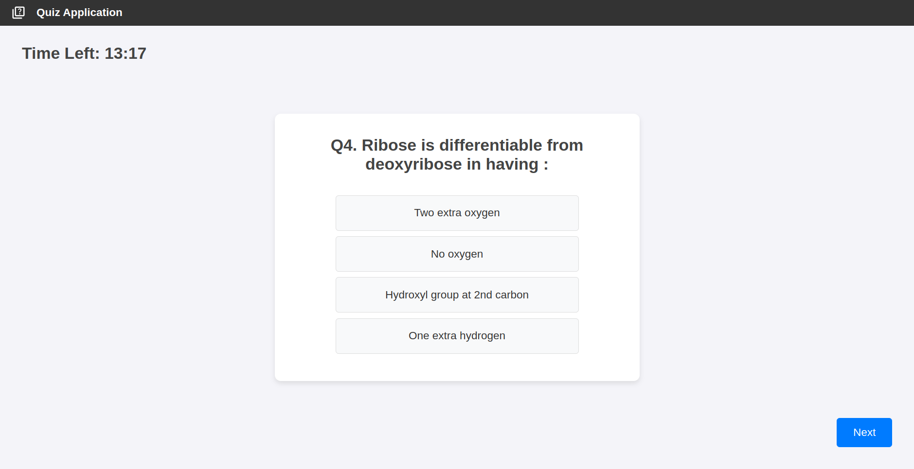
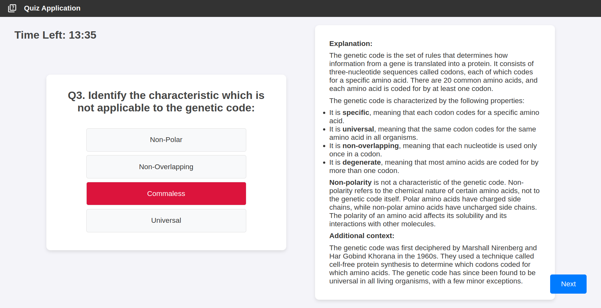
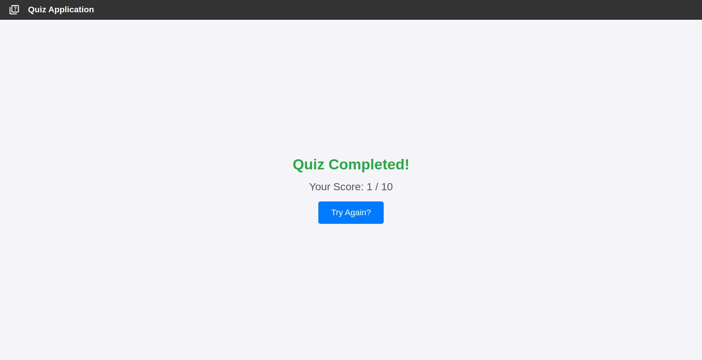

# Quiz Application Assignment

## Overview
A web-based quiz app assignment made for web dev internship application, fetching quiz data from an API.

## Features
- Start Quiz
- Multiple-choice questions
- Results summary
- Gamification (timer, points)

## Setup
1. Clone the repository.
2. Run `npm install`.
3. Run `npm run dev`.

## Video Walkthrough
[Watch Video](https://drive.google.com/file/d/1l4_0IFQzNqjjki1taeWDVUXBRh1qlLsb/view?usp=sharing)

## Screenshots

